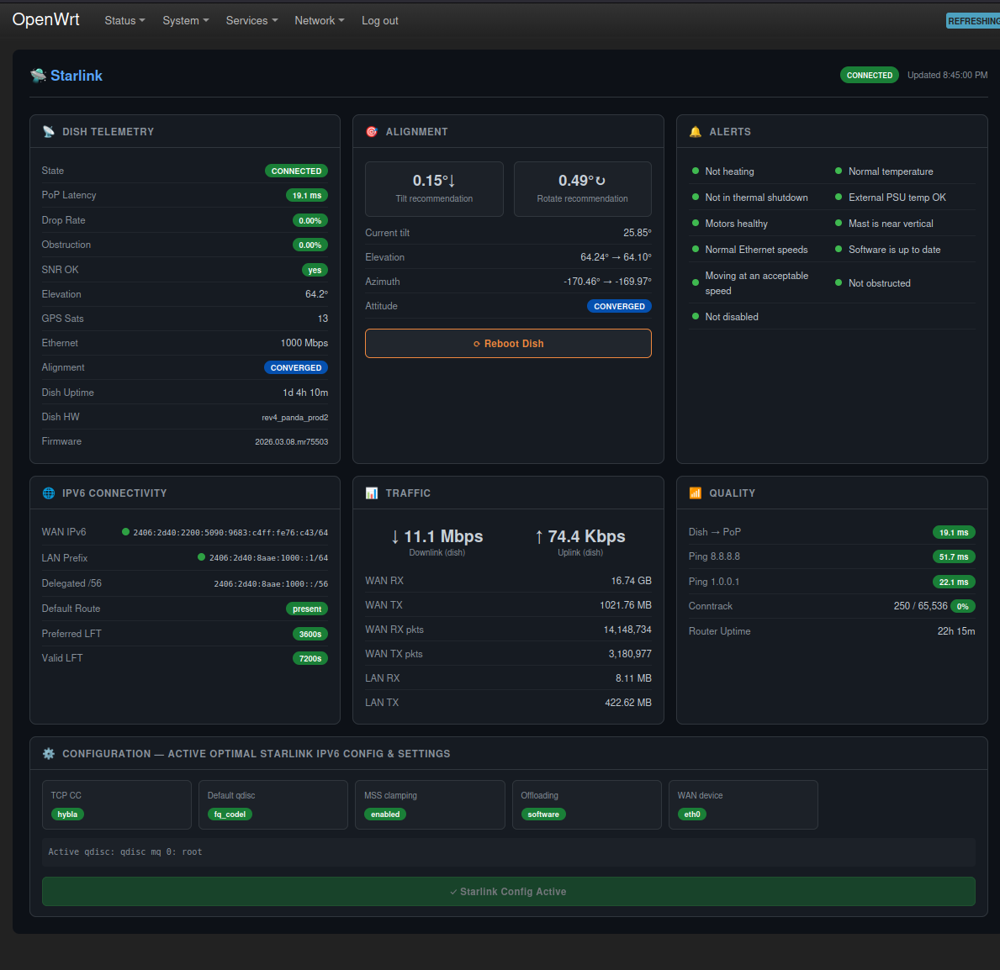

# luci-app-starlink

LuCI dashboard for Starlink dish telemetry, alignment, alerts, IPv6 connectivity, traffic, and router configuration on OpenWrt 25.x.



---

## Features

- **Dish Telemetry** — state, uptime, latency, packet drop, obstruction %, throughput, SNR, GPS satellites, Ethernet speed, hardware/software version
- **Alignment** — tilt and rotation guidance (↑↓ / ↻↶) with "well aligned" confirmation when within 0.1°
- **Alerts** — 11 health indicators matching the Starlink app (heating, thermal throttle, shutdown, PSU throttle, motors, mast, slow Ethernet, software update, roaming, obstruction, disabled)
- **IPv6 Connectivity** — WAN address, LAN address, delegated /56 prefix, default route
- **Traffic** — WAN and LAN byte/packet counters
- **Quality** — latency to 8.8.8.8 / 1.0.0.1, conntrack usage, router uptime
- **Configuration** — TCP congestion control, qdisc, flow offloading, MTU fix, DHCPv6-PD lifetime settings
- **Reboot Dish** button with confirmation dialog

Auto-refreshes every 10 seconds.

---

## Requirements

| Requirement | Notes |
|-------------|-------|
| OpenWrt 25.x | Uses `apk` package manager; tested on 25.12.0 |
| Architecture | `aarch64_cortex-a53` (GL-iNet Beryl AX / MT3000) — PKGARCH=all so works anywhere |
| `luci-base` | LuCI web interface |
| `rpcd` | RPC daemon (usually pre-installed) |
| `jsonfilter` | JSON parser for shell scripts |
| `grpcurl` | Required for dish telemetry (see below) |

---

## Install grpcurl

grpcurl is needed to query the Starlink dish gRPC API at `192.168.100.1:9200`.

```sh
# Download grpcurl v1.9.3 for linux/arm64
cd /tmp
wget -O grpcurl.tar.gz https://github.com/fullstorydev/grpcurl/releases/download/v1.9.3/grpcurl_1.9.3_linux_arm64.tar.gz
tar xzf grpcurl.tar.gz grpcurl
mv grpcurl /usr/bin/grpcurl
chmod +x /usr/bin/grpcurl

# Verify — should return dish status JSON
grpcurl -plaintext -d '{"getStatus":{}}' 192.168.100.1:9200 SpaceX.API.Device.Device/Handle
```

---

## Install the APK

Download the latest `.apk` from [Releases](../../releases).

```sh
# Copy to router
scp -O luci-app-starlink-1.0.0-r1.apk root@192.168.1.1:/tmp/

# Install (no key verification needed for local install)
ssh root@192.168.1.1 'apk add --allow-untrusted /tmp/luci-app-starlink-1.0.0-r1.apk'
```

The post-install script restarts `rpcd` and `uhttpd` automatically. Navigate to **Network → Starlink** in the LuCI menu.

---

## Build from Source

Requires Docker.

```sh
git clone https://github.com/bigmalloy/openwrt-starlink-control
cd openwrt-starlink-control
./build-apk-docker.sh
# Output: output/luci-app-starlink-*.apk
```

The build uses the official `openwrt/sdk:aarch64_cortex-a53-25.12.0-rc5` Docker image.

---

## Hardware Tested

| Device | GL-iNet Beryl AX (MT3000) |
|--------|--------------------------|
| SoC | MediaTek MT7981B |
| OpenWrt | 25.12.0 |
| Starlink | Gen3 dish (rev4_panda_prod2) |
| ISP | Starlink Residential (AU) |

---

## Buy me a beer

If this project saved you some time, feel free to shout me a beer!

[](https://paypal.me/bergfirmware)

---

## License

MIT
